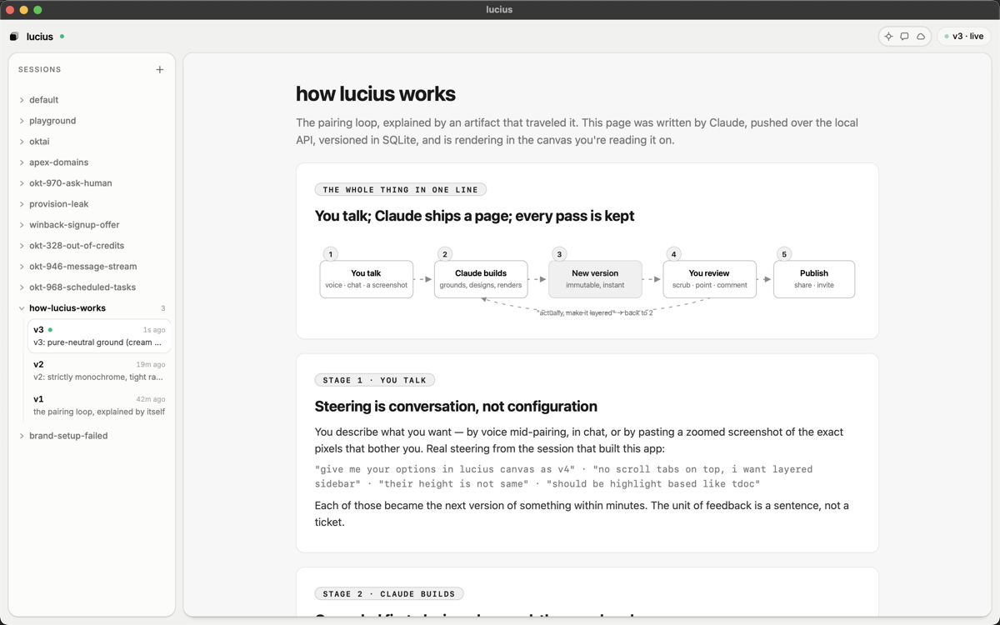

# lucius

**The canvas your AI pair draws on.**

[](https://github.com/berkantay/lucius/releases)
[](LICENSE)
[-black)](#install)
[](#set-it-up-with-claude-code)

You talk. Claude ships a page. Every pass is kept.

lucius is a desktop canvas where your coding agent renders rich, self-contained
HTML one-pagers — architecture explorers, product briefs, interactive
explainers, brainstorm artifacts — while you steer by voice or chat. Every push
is an immutable version you can scrub. Highlight any sentence to comment.
Publish to your own Cloudflare Worker, invite teammates by GitHub username,
and watch their comments flow back into the app while the agent's live
activity orb spins.



## Set it up with Claude Code

Paste this into any Claude Code session — your agent does the rest:

```text
Set up lucius (github.com/berkantay/lucius) on this machine:

1. macOS: run  curl -fsSL https://raw.githubusercontent.com/berkantay/lucius/main/install.sh | sh
   Linux: git clone https://github.com/berkantay/lucius, cd in, and follow SETUP.md instead.
2. Launch the app (open /Applications/lucius.app) and poll
   curl -s http://127.0.0.1:7317/api/ping until it answers {"app":"lucius","ok":true}.
3. Run ~/.lucius/src/scripts/doctor, execute every entry in missing_steps in
   order, and re-run doctor after each step. Never assume a step worked.
4. Run ~/.lucius/src/scripts/verify and do not report success until it prints
   VERIFY_OK and I confirm the app is showing "how lucius works".
5. Then follow the lucius-setup skill (~/.claude/skills/lucius-setup/SKILL.md)
   from Phase 2: ask me what I'm working on and render my first one-pager
   about it. Offer publishing and invites after.
```

Prefer doing it yourself? `curl -fsSL https://raw.githubusercontent.com/berkantay/lucius/main/install.sh | sh`,
open the app, done. From-source and manual paths: [SETUP.md](SETUP.md).

## Why lucius

- **Versions, not edits.** Every iteration is an immutable snapshot in SQLite.
  The sidebar is a timeline per session; "wait, go back to the earlier one"
  is a click, not an apology.
- **Feedback lands on the exact thing you mean.** Highlight text → comment,
  anchored to the phrase (tdoc-style anchors that survive new versions).
  Or point at any element with the crosshair — the agent reads exactly what
  you selected.
- **Sessions are workspaces.** One per topic, each with its own history,
  comments, and a live **thinking orb** while an agent works it — visible to
  you in the sidebar and to your team on the published page.
- **Publish to infrastructure you own.** One click puts a session on *your*
  Cloudflare Worker + R2 (free tier). Docs default to link-visibility; flip
  one private and invite GitHub usernames — uninvited visitors hit a sign-in
  gate. Viewer comments poll back into the app within a minute, and the agent
  replies on the page with what it changed.
- **Agent-native to the bone.** A Claude Code skill encodes the artifact
  quality bar (truth rules: ground in real repos, never simplify the system;
  taste rules: strict monochrome, anti-slop list). An embedded MCP server
  (`127.0.0.1:7317/mcp`) exposes render/comment/selection/status tools to any
  session. Setup, repair, publishing, and invites are all driven by the
  `lucius-setup` onboarding skill — your agent operates the product, not you.
- **Taste is enforced, not hoped for.** `skill/design.md` bans the AI-default
  looks by name (cream grounds, accent-color confetti, radius soup, stat-tile
  filler). Ink is the only accent.

## The loop

```
 1 you talk        2 claude builds      3 new version      4 you review        5 publish
 voice · chat  ─▶  grounds, designs ─▶  immutable,    ─▶   scrub · point  ─▶   share · invite
 a screenshot      renders              instant            comment
        ▲                                                      │
        └────────────── "actually, make it layered" ───────────┘
```

The unit of feedback is a sentence, not a ticket. This repo was built in one
day inside its own loop — the [example artifact](examples/how-lucius-works.html)
explaining it was written by Claude, rendered on the canvas it describes, and
committed as the reference for what generated pages should look like.

## Architecture

```
Claude Code ──(CLI / MCP, bearer token)──▶ control server (Rust, tiny_http :7317)
                                              │  SQLite: sessions · versions · comments
                                              │  Tauri events
                                              ▼
                                   app shell (React + Fluid Functionalism)
                                   layered sidebar · sandboxed iframe canvas
                                   highlight comments · selection · orbs
                                              │
                                   publish ──▶ your Cloudflare Worker + R2
                                              ◀── comment & status sync
```

| Path | What lives there |
|---|---|
| `src-tauri/` | Rust: SQLite store, control server + MCP, publish, comment poller |
| `src/` | React shell on [Fluid Functionalism](https://www.fluidfunctionalism.com) |
| `skill/` | The canvas skill: SKILL.md (workflow + truth rules), design.md (taste), `lucius` CLI |
| `setup-skill/` | The onboarding journey skill (install → first artifact → publish → invite) |
| `worker/` | Publish/comments worker, vendored from [tdoc](https://github.com/serenakeyitan/tdoc) (MIT) with an access-control wrapper |
| `scripts/` | `doctor` (machine-readable state) · `verify` (proves the loop) · `reset` (replay first-run) |
| `examples/` | The reference artifact |

## Roadmap

- A Claude per session — spawn a dedicated agent pinned to a workspace
- In-app comment threads over the canvas (stored + anchored today; minimal UI)
- Signed/notarized builds, Linux bundles
- Own GitHub OAuth app for viewer sign-in (currently tdoc's shared client id)

## Credits

Built by pairing with Claude, in one day, inside lucius itself. Standing on:
[tdoc](https://github.com/serenakeyitan/tdoc) (publish worker + comment
overlay, MIT), [Fluid Functionalism](https://www.fluidfunctionalism.com)
(shell components), [thinking-orbs](https://github.com/Jakubantalik/thinking-orbs)
(activity orbs), [Tauri](https://tauri.app) and [shadcn/ui](https://ui.shadcn.com).

## License

MIT — see [LICENSE](LICENSE).
